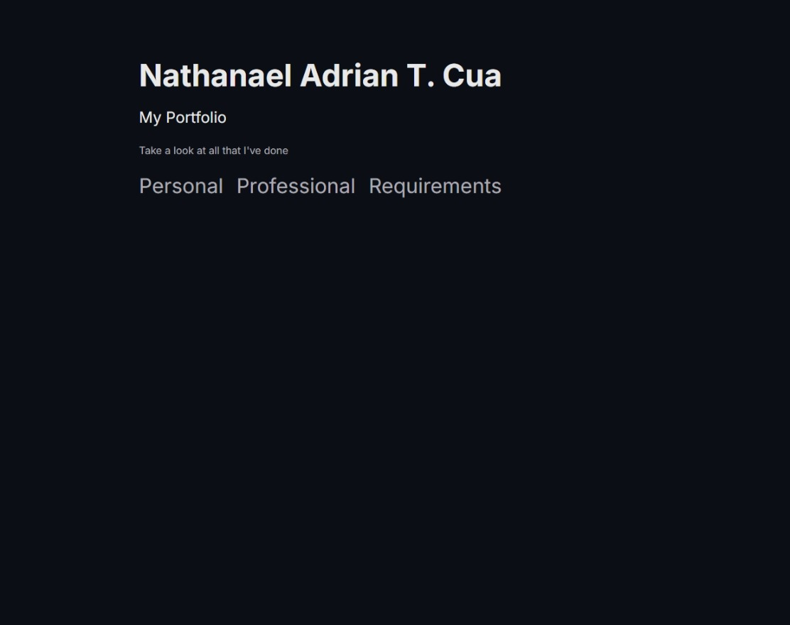
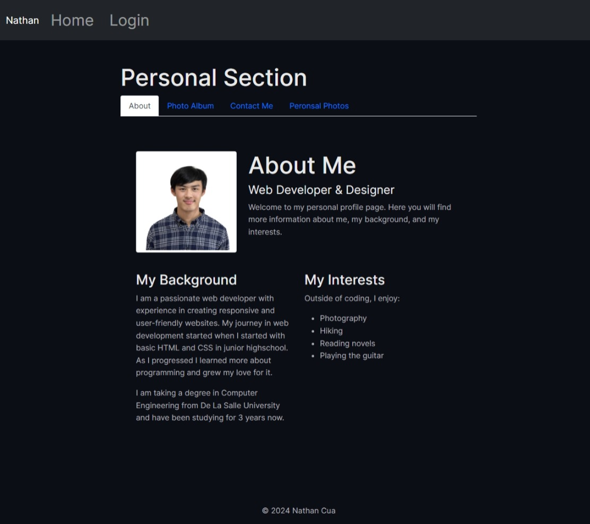
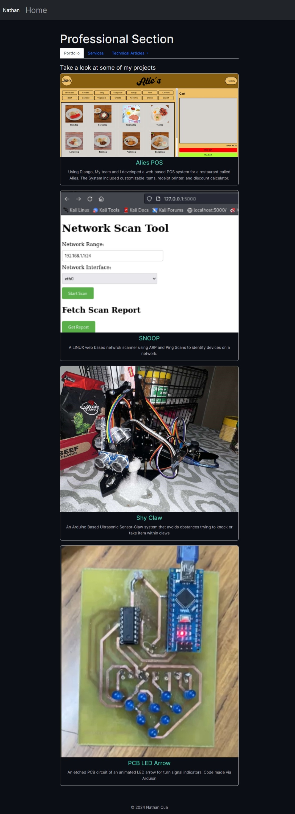

# Portfolio Website

This repository contains the source code for my portfolio website. It showcases my personal and professional projects, technical articles, and other achievements.

## Features
- **Personal Section**: Includes an about page, photo album, and password-protected pages.
- **Professional Section**: Displays portfolio projects, technical articles, and a service request form.
- **Interactive Elements**: Includes Google Charts, a technical calculator, and a video player.
- **Responsive Design**: Optimized for desktop and mobile devices.

## Screenshots
### Home Page


### Personal Section


### Professional Section


## Installation
1. Clone the repository:
   ```bash
   git clone https://github.com/natadecua/portfolio.git
   cd portfolio-website

2. Install Dependencies for the Node.hs server
    cd server
    npm install

3. Start the Services
    ./run-all.sh

4. Open Website in Browser
    http://localhost:8000

### Technologies Used
- **Frontend**: HTML, CSS, JavaScript, Bootstrap
- **Backend**: Node.js, Express.js
- **Charts**: Google Charts
- **File Uploads**: Multer
- **Authentication**: LocalStorage-based login system